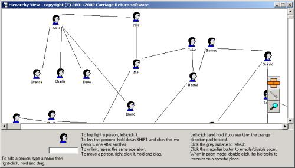



## Hierarchy v1\.0

### Description

This sample application wraps a set of functions used to create, manage, modify and display a hierarchy of objects (organigram, ...)

It uses only standard VB controls, no OCX or API calls needed. All comments are VERY welcome.
 
### More Info
 

             |
---                |---
**Submitted On**   |2002-04-25 10:17:22
**By**             |[Chris Gillent](https://github.com/Planet-Source-Code/PSCIndex/blob/master/ByAuthor/chris-gillent.md)
**Level**          |Intermediate
**User Rating**    |4.9 (73 globes from 15 users)
**Compatibility**  |VB 4\.0 \(32\-bit\), VB 5\.0, VB 6\.0
**Category**       |[Miscellaneous](https://github.com/Planet-Source-Code/PSCIndex/blob/master/ByCategory/miscellaneous__1-1.md)
**World**          |[Visual Basic](https://github.com/Planet-Source-Code/PSCIndex/blob/master/ByWorld/visual-basic.md)
**Archive File**   |[Hierarchy\_756474252002\.zip](https://github.com/Planet-Source-Code/chris-gillent-hierarchy-v1-0__1-34098/archive/master.zip)

